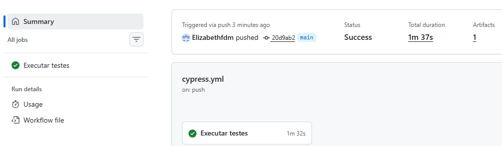

# Automação de Testes - ServeRest


Projeto desenvolvido para o desafio técnico de QA utilizando **Cypress** e **JavaScript**, contemplando testes automatizados de **Frontend** e **API** da aplicação ServeRest.

---

# Objetivo

Automatizar cenários E2E e de API utilizando boas práticas de desenvolvimento, garantindo:

- organização do projeto;
- reutilização de código;
- independência entre os testes;
- geração dinâmica de massa de dados;
- limpeza dos dados utilizados;
- integração contínua com GitHub Actions.

---

# Tecnologias utilizadas

| Tecnologia     | Finalidade                    |
| -------------- | ----------------------------- |
| Cypress        | Automação de testes E2E e API |
| JavaScript     | Linguagem utilizada           |
| Node.js        | Ambiente de execução          |
| Faker          | Geração de dados dinâmicos    |
| ESLint         | Padronização do código        |
| Prettier       | Formatação automática         |
| GitHub Actions | Integração contínua           |

---

# Estrutura do projeto

```text
.
├── .github
│   └── workflows
│       └── cypress.yml
│
├── cypress
│
│   ├── config
│   ├── e2e
│   │     ├── api
│   │     └── frontend
│   │
│   ├── factories
│   ├── fixtures
│   ├── pages
│   ├── services
│   ├── support
│   └── utils
│
├── cypress.config.js
├── package.json
└── README.md
```

---

# Cenários automatizados

## API

- Cadastro de usuário
- Login
- Cadastro de produto autenticado

## Frontend

- Login
- Cadastro de usuário
- Inclusão de produto na lista de compras

---

# Boas práticas aplicadas

- Page Object Model (POM)
- Service Layer
- Factory Pattern
- Dados dinâmicos utilizando Faker
- Limpeza automática da massa de dados
- Separação por responsabilidade
- ESLint
- Prettier
- Integração contínua

---

## Diferenciais do projeto

- Dados gerados dinamicamente utilizando Faker.
- Limpeza automática da massa de dados criada durante os testes.
- Separação entre testes de API e Frontend.
- Estrutura baseada em Page Objects, Services e Factories.
- Pipeline automatizada com GitHub Actions.
- Código padronizado com ESLint e Prettier.

---

# Como instalar

Clone o repositório:

```bash
git clone https://github.com/Elizabethfdm/serverest-cypress-automation.git
```

Entre na pasta:

```bash
cd serverest-cypress-automation
```

Instale as dependências:

```bash
npm install
```

---

# Executando os testes

## Executar todos

```bash
npm test
```

---

## Executar apenas API

```bash
npm run test:api
```

---

## Executar apenas Frontend

```bash
npm run test:frontend
```

---

## Abrir o Cypress

```bash
npm run cy:open
```

---

## Verificar padrão do código

```bash
npm run lint
```

---

## Formatar o projeto

```bash
npm run format
```

---

# Massa de dados

Os testes utilizam dados dinâmicos gerados com Faker.

Ao final da execução, os registros criados são removidos automaticamente da aplicação, permitindo que os cenários sejam executados repetidamente sem interferência.

---

# Integração Contínua

O projeto possui integração com GitHub Actions.

A cada push ou pull request para a branch principal são executados automaticamente:

- instalação das dependências;
- validação da formatação;
- análise estática do código;
- execução dos testes automatizados.

---

## Evidência de execução



---

# Autor

Elizabeth França

Projeto desenvolvido para avaliação técnica na área de Quality Assurance.
